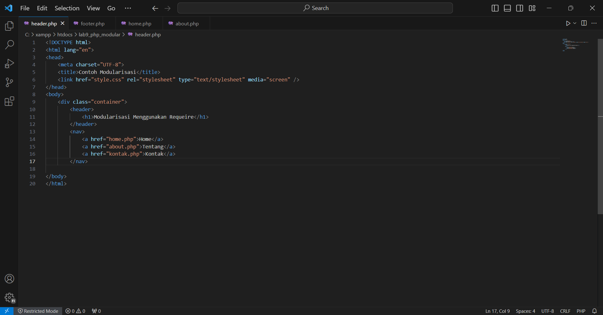
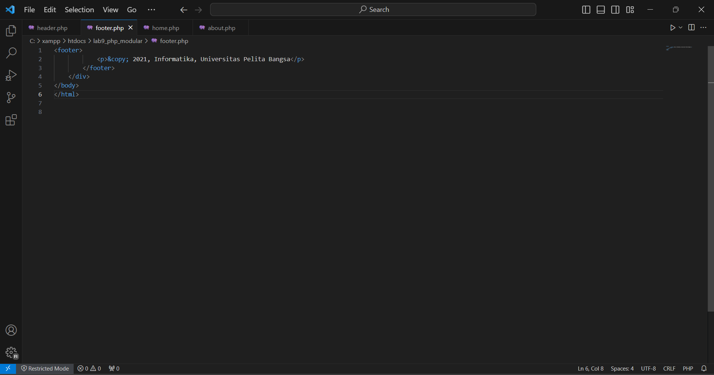
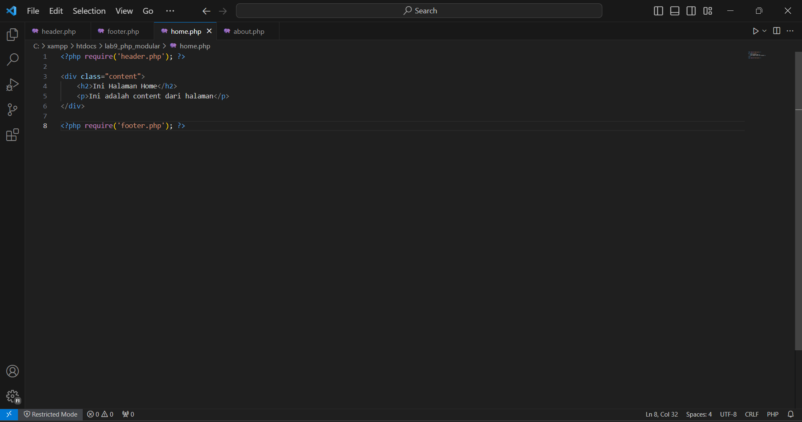
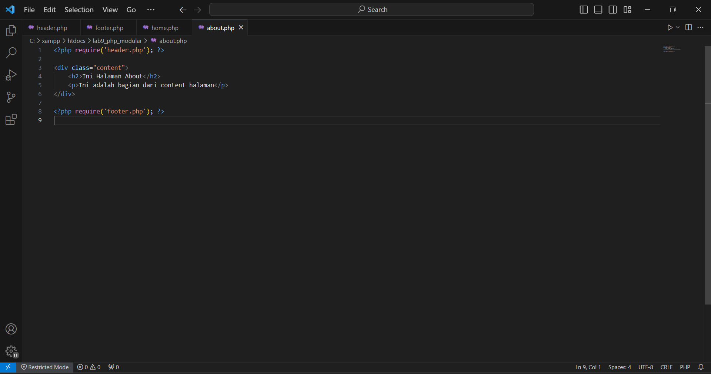
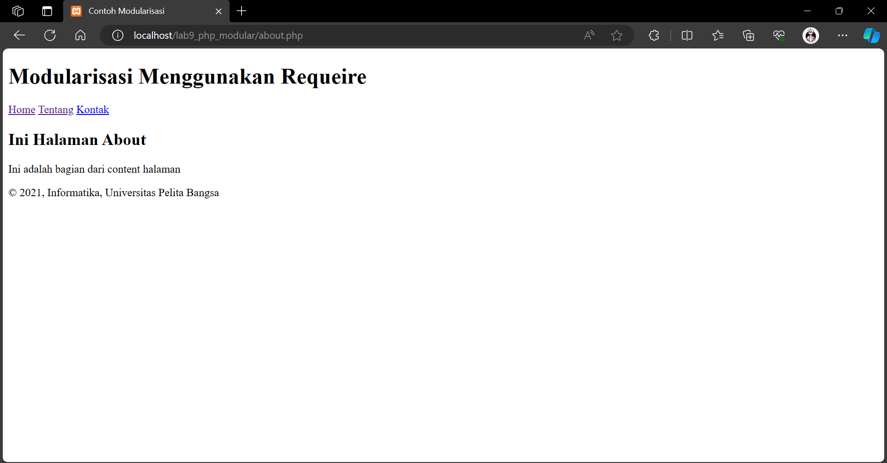
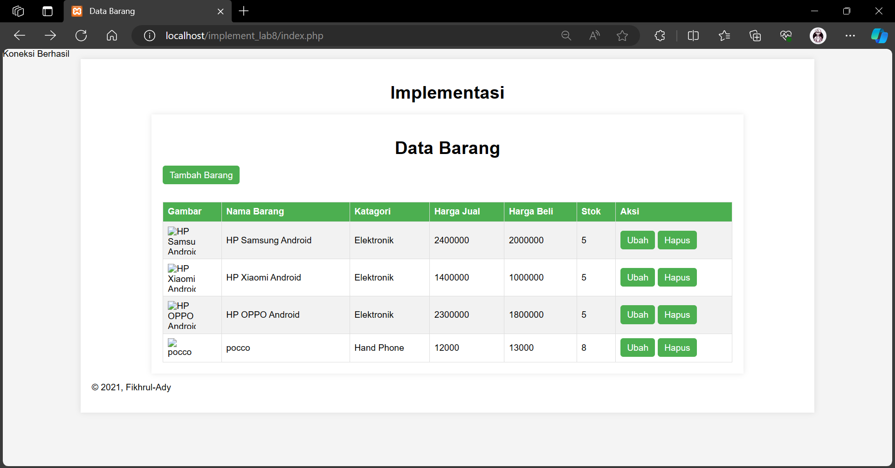

# Web9  
|**Nama**|**NIM**|**Kelas**|**Matkul**|
|----|---|-----|------|
|Muhammad Fiqri Setyoadi|312210062|TI.22.A.2|Pemograman Web|

### Langkah-langkah praktikum

- Buat file baru dengan nama header.php

- Buat file baru dengan nama footer.php

- Buat file baru dengan nama home.php

- Buat file baru dengan nama about.php

#### Ouput:
- About

- Home 

#### Pertanyaan dan Tugas
Implementasikan konsep modularisasi pada kode program praktikum 8 tentang database, sehingga setiap halamannya memiliki template tampilan yang sama.

- untuk melihat kode [klik disini](implement_lab8)

- ini adalah hasil implementasinya

